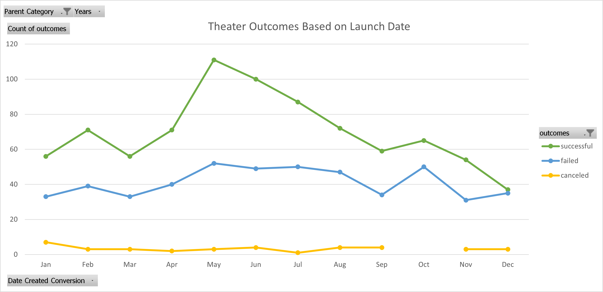
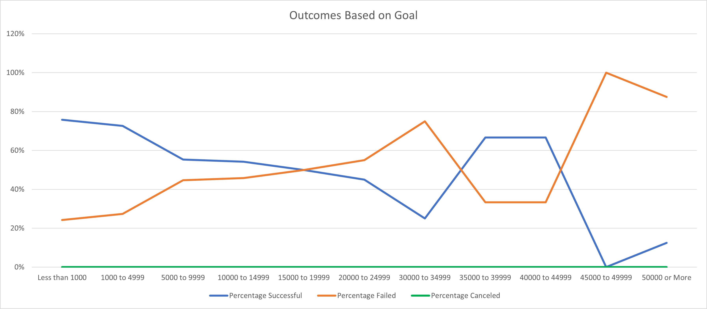

# Kickstarting with Excel

Please find here the link to the excel spreadsheet [*Kickstarter Challenge*](Kickstarter_Challenge.zip).

## 1. Overview of Project 

### Purpose 

#### Backstory
  Client Louise has held a campaign for her play *Fever*. The fundraising goal was $2,885.00 USD. The campaign started in June and ended in July. It ran for less than a month. Funds raised during the campaign were $2,485.00, $400 short of the fundraising goal. 

#### Purpose of the Project
  The purpose of this project is to analyze how different campaigns performed in relation to their launch dates and their funding goals. Specifically, this project analysis whether campaigns in the category *Theatre* and subcategory *Plays* were successful, and if the outcomes are dependent on the launch date of the campaign or the fundraising goal of the campaign.

## 2. Analysis and Challenges

### Analysis of Outcomes Based on Launch Date

In the category *Theatre*, the outcomes of campaigns have been analysed using data from 2009 to 2017. Campaigns were analyzed based on whether their fundraising goals were met (successful), not met (failed), or canceled (canceled). 

In the category Theatre, the largest number of campaigns were launched in May, June, and July (respectively). The graph ***Theater Outcomes Based on Launch Date*** visualizes the rise in successful campaigns in the months May, June, and July.

The graph visualizes an increase in the number of campaigns launched between May to July. The campaigns launched between May and July also show an increase in a successful outcome of campaigns run. Therefore, campaigns which are launched in May, June, or July tend to have a higher probability for a *successful* outcome. 

### Analysis of Outcomes Based on Goals

Using the data provided from 2009 to 2017 for the subcategory *Plays* within the parent category *Theatre*, a graph has been created to depict the success, failure and cancelation rate based on the fundraising goals of the campaigns.

The graph ***Outcomes Based on Goal***, showcases the fact that campaigns with larger fundraising goals, tend to have a higher failure rate and campaigns with lower fundraising goals, tend to have a higher success rate. 

 

#### Successful Outcome 
The graph depicts, that campaigns launched between 2009 and 2017, have been the most successful when the fundraising goal was lower than $15,000, and when the goals were between $35,000 to $45,000. 

#### Failed Outcome 
Campaigns had the highest failure rates when the fundraising goals were between $15,000 to $35,000, and when they were higher than $45,000. 

#### Canceled Outcome
No campaigns for the subcategory *Plays* have been canceled within this time frame. 

### Challenges and Difficulties Encountered

When analyzing the data for *Outcomes Based on Launch Date* and *Outcomes Based on Goals*, it was sometimes difficult the denote the detailed percentage rates by looking at the graphs only. This hindered a detailed analysis. 

#### Outcomes Based on Launch Date
To combat these challenges, I would recommend creating an additional table for *Outcomes Based on Launch Date* to denote the success, failure, and cancelation percentage rates based on which month of the year campaigns have been launched. This will aid in having a stronger base for the outcome of the analysis.

#### Outcomes Based on Goals
For the analysis for *Outcomes Based on Goals*, it can be difficult to denote the exact percentage rates using the graph only. To combat this, I used *Conditional Formatting* for the table in *Outcomes Based on Launch Date* to visualize the percentage rates. Fields in which the success rate was **over** 50% are blue, fields in which the failure rate was **below** 50%, are in orange.

## 3. Results

### What are two conclusions you can draw about the Outcomes based on Launch Date?
- The best time to launch a *Theatre* campaign for it to have the highest probability of it to yield a successful outcome, is between the months of May to July. 
- Launching a *Theatre* campaign in December or October yields the highest probability of a failed outcome. 

### What can you conclude about the Outcomes based on Goals?
-	Campaigns with goals lower than $15,000 yield higher success rates. 
-	Campaigns with goals over $45,000 yield higher failure rates.

### What are some limitations of this dataset?
-	The data we used for this analysis, was not specific enough to Louise’s target audience. We can create filters to show the target audience in each country. For *Outcomes Based on Launch Date* we could have also filtered the data for plays only, as she had run a play campaign.
-	The data does not provide further information as to why campaigns were canceled.
-	The data used for the span from 2009 to 2017. During this time, the target audience for each category will change, so it would be better to use a smaller date range for years to denote what is most relevant within the last few years. 

### What are some other possible tables and/or graphs that we could create?
-	To make the data even more specific to Louise, I would filter the country within the *Outcomes Based on Launch Date* table, to analyse the best possible probability for her to target her target audience.
-	To get a better understanding of the data, I would create an additional table for the analysis of *Outcomes Based on Launch Date* to showcase the percentage rates of successful, failed, and canceled campaigns. This information would strengthen the graph’s visual outcome.
-	An additional graph can be created for *Outcomes Based on Launch Date* and to filter *plays* only. 
-	A graph can be created to combine the data for both outcomes: *Outcomes Based on Launch Date and Goal* to show case whether there is a relation between both. 
